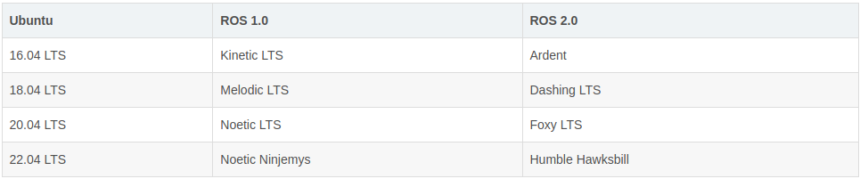

<!--
 * @Description : 
 * @Author      : Yufeng Zhang
 * @Date: 2023-09-15 11:21:57
 * @LastEditTime: 2023-09-18 11:21:34
-->
# 版本选择
ROS2支持Linux、MacOS、Windows和RTOS系统，与Ubuntu系统兼容性最好   
ROS和Ubuntu之间的版本对应关系如下:


# 系统编码设置
只有我们设置为UTF-8的英文编码才能正常安装运行于显示
```
sudo apt update
sudo apt install locales
sudo locale-gen en_US en_US.UTF-8
sudo update-locale LC_ALL=en_US.UTF-8 LANG=en_US.UTF-8
export LANG=en_US.UTF-8
```

# 添加ROS镜像源
